## Context

The nutrients module is a placeholder stub (`NutrientsController` with hardcoded data). Nutrients are the base enumeration of tracked stats (carbohydrates, protein, fat, phenylalanine) that ingredients will reference. The module needs a real data model, persistence, CRUD for admins, and a community suggestion-and-vote workflow for users.

The project uses Spring Modulith with a `common` shared module, OAuth2/Keycloak auth, Flyway migrations, and PostgreSQL. All modules follow the pattern: entity → repository → service → controller in `internal/`, with a public NamedInterface at the module root if cross-module access is needed.

## Goals / Non-Goals

**Goals:**
- `Nutrient` entity with id (UUID), name (unique), kcalPerGram (nullable BigDecimal), defaultUnit (GRAM/MILLIGRAM enum), status (ACTIVE/SUGGESTED), source (SEED/ADMIN/SUGGESTION), authorId (nullable), createdAt timestamp
- `NutrientVote` entity linking a user to a suggested nutrient
- Flyway migration (V2) creating `nutrients` and `nutrient_votes` tables + inserting seed data (carbohydrates, protein, fat, phenylalanine)
- Two REST resource paths: `/v1/nutrients` (ACTIVE only) and `/v1/nutrient-suggestions` (SUGGESTED only)
- Admin CRUD on `/v1/nutrients`, user suggestion/vote on `/v1/nutrient-suggestions`
- `@HasAdminRole` on admin mutation endpoints, `@HasUserRole` on suggestion/vote endpoints, `@HasUserOrAdminRole` on read endpoints
- Auto-approval of suggestions at 10 votes (flips status from SUGGESTED to ACTIVE)
- Input validation, pagination (default 20), name filtering, sorting (name ASC by default), 201/200/204/404/409 status codes
- HATEOAS links in HAL format: coarse links on collection responses, fine-grained per-resource links on individual items

**Non-Goals:**
- No frontend UI in this change (separate change follows)
- No NamedInterface (NutrientLookup) — will be added when cross-module consumers exist
- No email notifications for suggestion approval
- No vote expiry or withdrawal

## Decisions

### 1. Single table with status field instead of two tables

A single `nutrients` table with a `status` column (ACTIVE / SUGGESTED) stores both admin-created and user-suggested nutrients. Two REST controllers expose different views: `NutrientsController` returns only ACTIVE, `NutrientSuggestionsController` returns only SUGGESTED. This avoids duplicating the data model and simplifies migration when a suggestion is approved (just flips status).

**Alternatives considered:**
- Two tables (`nutrients` + `nutrient_requests`): Rejected — data-copy step on approval introduces drift and complexity.
- Two tables with FK from requests to nutrients: Rejected — over-engineered for the current requirements.

### 2. Split into three controllers (separation of concerns)

Three controllers maintain clean boundaries:
- `NutrientsController` — ACTIVE nutrients, admin CRUD
- `NutrientSuggestionsController` — SUGGESTED nutrients, user suggestion/vote, admin approve
- All delegate to `NutrientService` for persistence operations

**Alternatives considered:**
- Single controller: Rejected — mixes two authorization schemes and resource lifecycles.
- Two controllers (active + suggestions): Chosen — cleanest separation.

### 3. HATEOAS with HAL format

API responses include `_links` following the HAL specification. Collection responses carry coarse links (what the user can do overall). Individual resources carry fine-grained links (what the user can do with this specific item). Links are conditionally included based on the authenticated user's role.

**Alternatives considered:**
- Custom links array: Rejected — HAL is a standard, Spring HATEOAS integrates natively.
- No links: Rejected — frontend needs capability discovery for role-based UI without hardcoding role checks.

### 4. NutrientUnit enum with GRAM and MILLIGRAM

Macronutrients (carbs, protein, fat) use grams; trace nutrients (phenylalanine) use milligrams. Using an enum keeps the domain explicit and fits in a single DB column.

**Alternatives considered:**
- Always grams: Rejected — phenylalanine is typically tracked in mg.
- Free-text unit string: Rejected — adds ambiguity and validation burden.

### 5. Unique name constraint on nutrients at DB level

Duplicate nutrient names are prevented by a unique constraint, checked before inserts in both the CRUD service and the suggestion approval flow.

**Alternatives considered:**
- Application-level check only: Rejected — race conditions could allow duplicates under concurrent requests.

### 6. Auto-approval via domain service with pessimistic lock

When the 10th vote is cast, the vote service checks the count under `PESSIMISTIC_WRITE` lock and immediately flips the nutrient to ACTIVE. No scheduled job needed.

**Alternatives considered:**
- Scheduled job to check vote thresholds: Rejected — adds latency and complexity.
- Optimistic lock: Rejected — race between two concurrent votes could both see 9 votes and both try to approve.

## REST API

| Method | Path | Controller | Auth | Notes |
|---|---|---|---|---|
| GET | `/v1/nutrients` | NutrientsController | USER or ADMIN | Paginated, ACTIVE only, name filter, sort |
| GET | `/v1/nutrients/{id}` | NutrientsController | USER or ADMIN | ACTIVE only, 404 if not found or not ACTIVE |
| POST | `/v1/nutrients` | NutrientsController | ADMIN | Creates ACTIVE, source=ADMIN |
| PUT | `/v1/nutrients/{id}` | NutrientsController | ADMIN | Updates ACTIVE fields |
| DELETE | `/v1/nutrients/{id}` | NutrientsController | ADMIN | Deletes any status |
| GET | `/v1/nutrient-suggestions` | NutrientSuggestionsController | USER or ADMIN | Paginated, SUGGESTED only, vote count |
| GET | `/v1/nutrient-suggestions/{id}` | NutrientSuggestionsController | USER or ADMIN | SUGGESTED only |
| POST | `/v1/nutrient-suggestions` | NutrientSuggestionsController | USER | Creates SUGGESTED, source=SUGGESTION |
| POST | `/v1/nutrient-suggestions/{id}/votes` | NutrientSuggestionsController | USER | One vote per user per suggestion |
| POST | `/v1/nutrient-suggestions/{id}/approve` | NutrientSuggestionsController | ADMIN | Flips SUGGESTED → ACTIVE |

## Architecture

```mermaid
flowchart LR
  subgraph nutrient[Nutrient Module]
    subgraph internal[internal/]
      ctrl1[NutrientsController<br/>&#47;v1/nutrients]
      ctrl2[NutrientSuggestionsController<br/>&#47;v1/nutrient-suggestions]
      service[NutrientService]
      repo[NutrientRepository]
      voteRepo[NutrientVoteRepository]
      entity[Nutrient]
      voteEntity[NutrientVote]
    end
  end

  client[API Client] -->|"ACTIVE CRUD"| ctrl1
  client -->|"SUGGESTION vote"| ctrl2
  ctrl1 --> service
  ctrl2 --> service
  service --> repo
  service --> voteRepo
  repo --> db[(PostgreSQL)]
  voteRepo --> db
```



## Data Model

**nutrients** table:
| Column | Type | Notes |
|---|---|---|
| id | uuid | PK |
| name | varchar(255) | UNIQUE, NOT NULL |
| kcal_per_gram | decimal(10,4) | nullable |
| default_unit | varchar(20) | NOT NULL, GRAM or MILLIGRAM |
| status | varchar(20) | NOT NULL, ACTIVE or SUGGESTED |
| source | varchar(20) | NOT NULL, SEED or ADMIN or SUGGESTION |
| author_id | varchar(255) | nullable, null for SEED |
| created_at | timestamp | NOT NULL |

**nutrient_votes** table:
| Column | Type | Notes |
|---|---|---|
| id | uuid | PK |
| nutrient_id | uuid | FK → nutrients.id, NOT NULL |
| voter_id | varchar(255) | NOT NULL, JWT subject |
| created_at | timestamp | NOT NULL |
| UNIQUE(nutrient_id, voter_id) | | one vote per user per suggestion |

**Seed data** (inserted in V2 migration):
| name | kcal_per_g | default_unit | status | source |
|---|---|---|---|---|
| Carbohydrates | 4.0 | GRAM | ACTIVE | SEED |
| Protein | 4.0 | GRAM | ACTIVE | SEED |
| Fat | 9.0 | GRAM | ACTIVE | SEED |
| Phenylalanine | null | MILLIGRAM | ACTIVE | SEED |

## HATEOAS Link Structure

### Collection-level links (`GET /v1/nutrients`)

```json
{
  "_links": {
    "self": { "href": "/v1/nutrients?page=0&size=20" },
    "create-nutrient": { "href": "/v1/nutrients", "method": "POST" }
  }
}
```

The `create-nutrient` link is only present when the user has the ADMIN role.

### Collection-level links (`GET /v1/nutrient-suggestions`)

```json
{
  "_links": {
    "self": { "href": "/v1/nutrient-suggestions?page=0&size=20" },
    "suggest-nutrient": { "href": "/v1/nutrient-suggestions", "method": "POST" }
  }
}
```

The `suggest-nutrient` link is only present when the user has the USER role (not ADMIN-only).

### Resource-level links (`GET /v1/nutrients/{id}`)

```json
{
  "id": "...",
  "name": "Carbohydrates",
  "_links": {
    "self": { "href": "/v1/nutrients/{id}" },
    "edit": { "href": "/v1/nutrients/{id}", "method": "PUT" },
    "delete": { "href": "/v1/nutrients/{id}", "method": "DELETE" }
  }
}
```

The `edit` and `delete` links are only present for admin users.

### Resource-level links (`GET /v1/nutrient-suggestions/{id}`)

```json
{
  "id": "...",
  "name": "Vitamin C",
  "voteCount": 3,
  "_links": {
    "self": { "href": "/v1/nutrient-suggestions/{id}" },
    "vote": { "href": "/v1/nutrient-suggestions/{id}/votes", "method": "POST" },
    "approve": { "href": "/v1/nutrient-suggestions/{id}/approve", "method": "POST" }
  }
}
```

The `vote` link is present when the user has the USER role and hasn't already voted. The `approve` link is present only for admin users.

## Risks / Trade-offs

- **[Risk]** Vote threshold race: two votes arriving simultaneously could push count past 10 and trigger approval twice. → Mitigation: use `@Lock(PESSIMISTIC_WRITE)` on the nutrient row when checking threshold.
- **[Risk]** Nutrient created via suggestion auto-approval has no admin review for correctness. → Mitigation: admin can always edit or delete the created nutrient directly.
- **[Trade-off]** Synchronous auto-approval adds latency to the vote endpoint. Acceptable because vote endpoint is not high-throughput.

## Open Questions

- Vote threshold of 10 is hardcoded for now — could be made configurable later.
- Name filter and sort param conventions will follow Spring Data's existing pattern (e.g., `?name=vit&sort=name,asc`).
